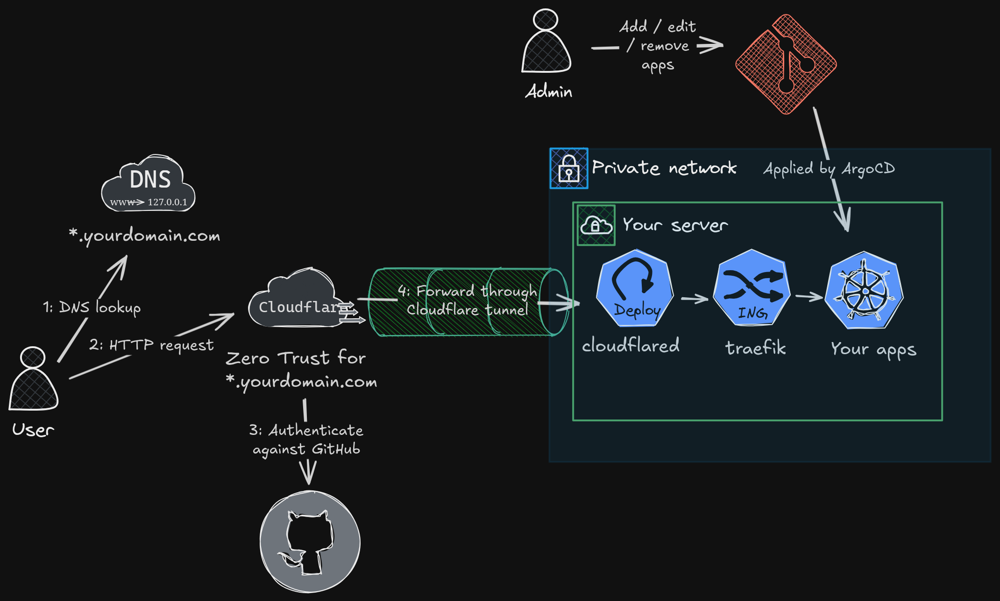
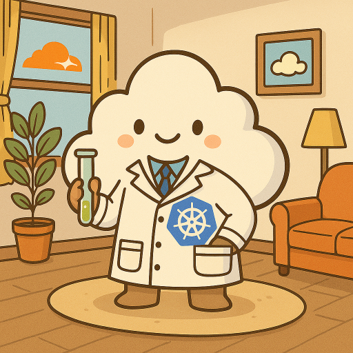

# What is this?

This is a guide for building your own Kubernetes cloud lab at home with *everything* managed through a github repo, with apps exposed to selected github users[^1] using only their web browser. Offloads the the boring & hard stuff - security, authentication and patching of internet facing components to Cloudflare & GitHub.

## Who is this for

* You want to self host apps available as docker containers and make them available to authenticated users[^2] without a VPN
* Or you want to learn about Kubernetes, a "full fat" cloud platform that powers the likes of ChatGPT, without the risk of bill shock from a cloud provider

and

* You don't want to learn about how to build and manage infrastructure below Kubernetes (hardware, networking, traditional IaaS)

## What do I need?

* Hardware supported by [Talos](https://www.talos.dev) (e.g. Raspberry Pi 4 or a [x86 mini PC](https://www.servethehome.com/tag/tinyminimicro/) - _absolute_ minimum 4GB RAM) running 24x7, or a VM. Instructions are for a single node, but more can be added
* Wired Ethernet
* A domain name (<$5 per year)
* Free GitHub and Cloudflare account

## Security

When running a homelab you want the convenience of accessing it from anywhere, but not the worry of it [getting hacked](https://www.reddit.com/r/selfhosted/comments/13f6b89/has_anyone_ever_had_their_homelab_or_network/) because you didn't [patch quickly enough](https://www.reddit.com/r/selfhosted/comments/1po9cx1/vps_hacked_over_and_over_what_am_i_doing_wrong/) or you [accidentally exposed unauthenticated or weak passwords](https://techcommunity.microsoft.com/blog/microsoftdefendercloudblog/the-risk-of-default-configuration-how-out-of-the-box-helm-charts-can-breach-your/4409560) to the Internet. This responsibility is all handled by Cloudflare and GitHub. For full details, see the [threat model](THREAT_MODEL.md)

## Minimal admin

Keeping things updated is dull. When things stop working you have to remember what config file or cloud provider setting you tweaked a few months ago and why (aka. [clickops](https://medium.com/@malinisharma.nj/debunking-clickops-bbae641c3874)). We use a github repo ([template gitops repo](https://github.com/laurence404/gitops-template)) to control all the apps (helm charts or kustomize manifests) you want to run and their config which is automatically deployed when you change them. Dependabot will send you PRs to merge at your leisure with updates, which are then automatically rolled out. If anything goes wrong you can revert. Talos is used as an atomic container optimised OS, which requires no maintenance.

If you want to remove something you've been experimenting with - just remove from git and delete the namespace.

Running terraform manually every time you add a new app is tiresome, so all the Cloudflare config is a one-off bootstrap. From then on, everything is via your git repo.

## No VPN

No VPN client is required to access your apps - they'll be hosted under your domain with Cloudflare handling authentication. aka a "Zero Trust" architecture.

## Security updates

If you use this repo, it's highly recommend to watch this repo for Security Alerts (Watch -> Custom -> Security Alerts)

## Obligatory AI generated logo

[^1]: Cloudflare supports other login providers such as [Facebook](https://developers.cloudflare.com/cloudflare-one/identity/idp-integration/facebook-login/) - but you'll need to modify the terraform
[^2]: You can edit the Cloudflare zero trust config to expose selected domains without authentication, but you'll need to consider the security implications
